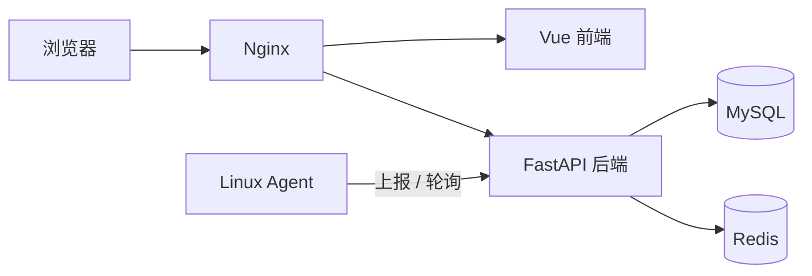

# Ops Monitor

轻量级服务器运维监控与自动化管理平台：通过 Agent（Python / Go 双运行时）采集 Linux 服务器状态，由 FastAPI 后端统一处理，经 Vue 管理端提供监控、告警与服务管理能力。

## 功能

- 服务器资产管理与 Agent 在线状态
- 指标采集与可视化（CPU / 内存 / 磁盘 / 网络 / Load / TCP / 进程）
- 阈值告警（规则、事件、确认、恢复）
- 服务管理（状态监控、受控启停、日志）
- 自动化任务（单机 / 批量 / 定时、执行记录）
- 用户认证与 RBAC 权限、操作审计
- Docker Compose 配置化部署

## 架构



详见 [docs/architecture/overview.md](docs/architecture/overview.md)。

## 快速开始

```bash
# 平台（配置化部署）
cp deploy/config.env.tmpl deploy/config.env   # 编辑 HOSTNAME/HTTP_PORT/密码
./deploy/install.sh

# 或：从 Docker Hub 拉取预构建镜像（免本地构建/登录）
cp deploy/config.dockerhub.env.tmpl deploy/config.env   # 编辑 HOSTNAME 与 IMAGE_REGISTRY 的 <namespace>
./deploy/install.sh
```

详见 [docs/operations/deployment.md](docs/operations/deployment.md)。

## 文档

- [Getting Started](docs/getting-started/)
- [Architecture](docs/architecture/)
- [Modules](docs/modules/)
- [Reference](docs/reference/)
- [Operations](docs/operations/)
- [Architecture Decisions](docs/decisions/)
- [Optimization Plan](docs/optimization-plan.md)

## 开发

- [开发指南](docs/getting-started/development.md)
- [本地环境](docs/getting-started/local-environment.md)
- [贡献指南](CONTRIBUTING.md)

## 部署

- [平台部署](docs/operations/deployment.md)
- [Agent 部署](docs/operations/agent-deployment.md)

## 许可证

本项目基于 [Apache License 2.0](LICENSE) 许可发布；依赖许可证清单见 [依赖许可证清单](docs/reference/license-inventory.md)。
