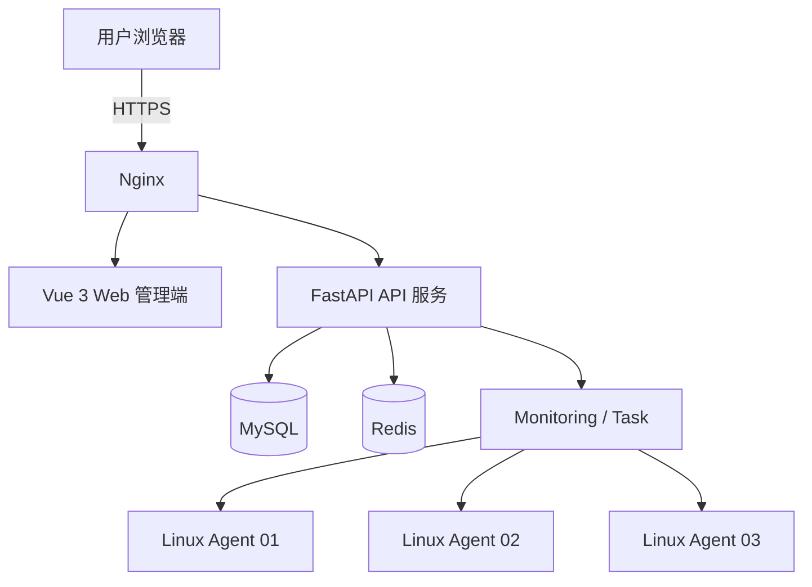

# 项目概览

> 本文档为总体规划的精编版，供开发与协作参考。完整规划在 vault 中维护。

## 一、项目背景

中小规模服务器环境中，运维人员通常需通过 SSH 逐台执行 `top`、`free`、`df`、`ps`、`systemctl`、`journalctl` 等命令。传统人工运维存在以下问题：

1. **服务器状态分散** —— 无法统一查看多台服务器 CPU、内存、磁盘、网络指标。
2. **故障发现不及时** —— 指标异常无法主动通知，关键服务停止需人工发现。
3. **运维操作重复** —— 服务重启、状态检查重复性高，批量执行效率低。
4. **缺少统一操作记录** —— 运维操作无法审计追溯。
5. **监控数据缺少可视化** —— 缺少历史趋势分析。

## 二、项目目标

搭建标准化 Web 运维监控系统，实现统一采集、集中展示、异常告警和基础自动化运维：

1. Linux 服务器统一注册与资产管理
2. CPU、内存、磁盘、网络、Load 等核心指标采集
3. 实时及周期性监控
4. 异常阈值检测及告警
5. Nginx、Docker 等服务状态监控
6. 基础运维任务管理
7. 操作日志与任务执行记录
8. Docker Compose 快速部署
9. 良好扩展性，为接入 Prometheus、Kubernetes 打基础

## 三、功能架构

```text
轻量级服务器运维监控平台
│
├── 1. 用户与权限管理
│   ├── 用户登录
│   ├── 用户管理
│   ├── 角色管理
│   └── 权限控制
│
├── 2. 服务器管理
│   ├── 服务器注册
│   ├── 服务器列表
│   ├── 服务器详情
│   └── Agent 状态
│
├── 3. 监控中心
│   ├── CPU 监控
│   ├── 内存监控
│   ├── 磁盘监控
│   ├── 网络监控
│   ├── Load 监控
│   └── Docker 监控
│
├── 4. 告警中心
│   ├── 告警规则
│   ├── 告警事件
│   ├── 告警确认
│   └── 告警恢复
│
├── 5. 服务管理
│   ├── 服务状态
│   ├── 服务启动 / 停止 / 重启
│   └── 日志查看
│
├── 6. 自动化任务
│   ├── 单机任务
│   ├── 批量任务
│   ├── 定时任务
│   └── 任务执行记录
│
└── 7. 操作审计
    ├── 登录日志
    ├── 操作日志
    └── 任务执行日志
```

## 四、角色权限

| 角色 | 权限 |
| --- | --- |
| 系统管理员 | 用户管理、角色管理、服务器管理、监控管理、告警管理、任务管理、系统日志查看 |
| 运维人员 | 服务器监控、服务管理、运维任务、告警处理 |
| 普通用户 | 查看授权服务器及授权监控数据 |

## 五、整体架构

前后端分离 + Agent/Server 架构。



### 分层

- **前端**：视图层（页面/表格/图表）→ 交互层（表单校验/弹窗/确认）→ 请求层（Axios 封装/拦截器/Token）→ 状态层（用户/Token/权限/配置）
- **后端**：Router（参数校验、统一响应）→ Service（业务、权限、告警计算、任务调度）→ Repository（数据访问）→ Model（ORM 实体）→ Schema（参数校验/响应格式化）→ Core（JWT/异常/日志/配置）
- **Agent**：Collector（CPU/Memory/Disk/Network/Process/Docker 采集）→ Reporter（Metrics/Heartbeat 上报）→ Executor（受控命令执行）→ Config（配置管理）

## 六、需求边界

- **包含**：Web 管理平台、Linux Agent、资产管理、Linux/Docker 监控、告警管理、服务状态管理、基础自动化任务、用户权限、操作审计、MySQL 存储、Docker Compose 部署。
- **不包含**：移动端 App、短信告警、微信/钉钉推送、公有云自动建机、K8s 自动管理、自动扩缩容、大规模分布式监控、高风险自动修复、多数据中心容灾。

## 七、非功能需求

- **性能**：普通查询接口 ≤ 500ms；监控默认采集周期 10 秒；支持多 Agent 并发上报；历史数据分页查询；高频数据独立存储。
- **安全**：密码禁止明文存储；JWT 身份认证；角色权限隔离；Agent 上报接口鉴权；运维操作审计；严格限制 Shell 执行；禁止普通用户执行高风险命令；高风险操作二次确认。
- **可维护性**：前后端分离；Controller/Service/Repository 分层；采集模块插件化；告警规则与业务解耦；统一异常与日志；Git 版本管理；Docker Compose 部署。
- **兼容性**：服务器端支持 Debian、Ubuntu；浏览器支持 Chrome、Edge、Firefox。

## 八、扩展规划

- **V2.0 专业监控**：Prometheus、Grafana、Node Exporter、Alertmanager
- **V3.0 云原生**：Kubernetes、Helm、Ingress、HPA
- **V4.0 SRE 能力**：SLA/SLI/SLO、Error Budget、故障演练、事件管理、On-call

## 九、接口一览

| 模块 | 方法与路径 |
| --- | --- |
| 登录 | `POST /api/v1/auth/login` |
| 服务器 | `GET/POST /api/v1/servers`、`GET/PUT/DELETE /api/v1/servers/{id}` |
| 监控 | `GET /api/v1/servers/{id}/metrics`、`/metrics/latest`、`/metrics/history` |
| Agent | `POST /api/v1/agent/register`、`/heartbeat`、`/metrics`、`/task/result` |
| 告警 | `GET /api/v1/alerts`、`GET /api/v1/alerts/{id}`、`POST /api/v1/alerts/{id}/ack`、`/resolve` |
| 任务 | `GET /api/v1/tasks`、`POST /api/v1/tasks`、`GET /api/v1/tasks/{id}`、`POST /api/v1/tasks/{id}/cancel` |

> 接口细节待实现后补充至接口文档。
