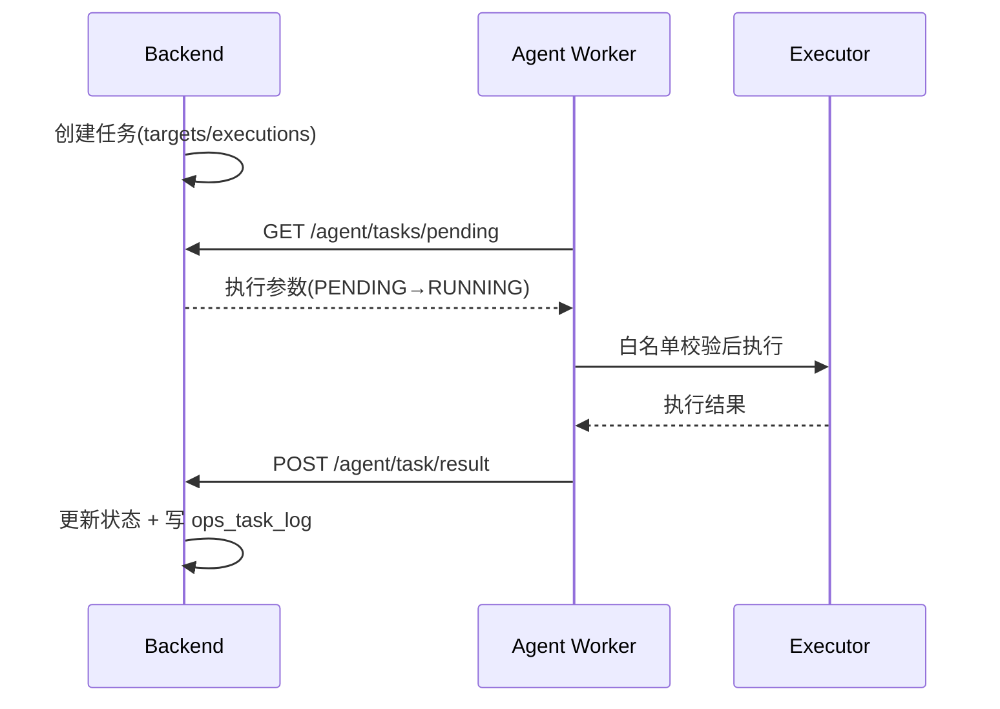

# Agent 架构

## 定位

Agent 是部署在被监控 Linux 服务器上的采集与执行程序，以 **systemd 原生服务**运行（不做核心容器化），负责：

- 系统信息与指标采集（CPU/内存/磁盘/网络/Load/TCP/进程）
- 服务状态采集
- 心跳与指标上报
- 受控任务执行（服务管理、日志）

## 模块结构

```text
agent/
├── collector/     # cpu memory disk network system service 采集
├── reporter/      # client（HTTP + 重试） report（注册/心跳/指标/资产/服务/任务结果）
├── executor/      # service.py 受控 systemctl/journalctl 执行
├── config/        # config.py + config.yaml.example
├── utils/         # logger
├── worker.py      # TaskWorker：轮询任务并执行回传
├── main.py        # Agent 主控（注册 + 多线程循环）
├── install.sh     # 一键安装（systemd）
└── VERSION
```

> Agent 以 systemd 原生部署（需要宿主 `systemctl` 与 `/proc` 访问），不提供容器化部署。

## 职责分层

| 模块 | 职责 |
| --- | --- |
| Collector | 采集指标、系统信息、资产、服务状态 |
| Reporter | 通过 `AgentClient` 上报注册/心跳/指标/资产/服务/任务结果（指数退避重试） |
| Executor | 白名单二次校验后执行 `systemctl`/`journalctl`，参数列表、禁 shell、超时 |
| Worker | 每 `task_poll_interval` 轮询 `/agent/tasks/pending`，执行并回传结果 |

## 运行模型

`main.py` 注册成功后启动四个守护线程：

| 线程 | 周期 | 动作 |
| --- | --- | --- |
| heartbeat | `heartbeat_interval`（30s） | 发送心跳 |
| metrics | `metrics_interval`（10s） | 采集并上报指标 |
| assets | `assets_interval`（60s） | 同步磁盘/网卡资产与服务状态 |
| task-worker | `task_poll_interval`（5s） | 轮询并执行任务 |

网络异常采用指数退避重试；进程退出由 systemd `Restart=always` 拉起。

## 与后端的关系

- 通信方向始终为 **Agent → Backend**（主动上报/轮询），后端不主动连接 Agent。
- Agent 使用独立 Token 鉴权，Token 由平台生成、数据库仅存哈希。

详见 [reference/agent-protocol.md](../reference/agent-protocol.md) 与 [decisions/002-agent-reporting.md](../decisions/002-agent-reporting.md)。

## 任务流



## 部署

一键安装（平台托管包或脚本）见 [operations/agent-deployment.md](../operations/agent-deployment.md)。
