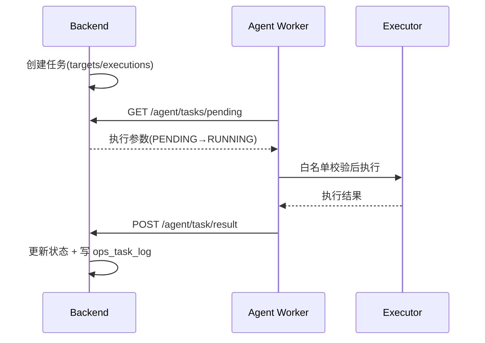

# Agent 架构

## 定位

Agent 是部署在被监控 Linux 服务器上的采集与执行程序，以 **systemd 原生服务**运行（不做核心容器化），负责：

- 系统信息与指标采集（CPU/内存/磁盘/网络/Load/TCP/进程）
- 服务状态采集
- 心跳与指标上报
- 受控任务执行（服务管理、日志）

## 双运行时

Agent 提供两个功能对等的实现，共享同一份协议与配置 schema：

| 实现 | 目录 | 运行方式 | 依赖 |
| --- | --- | --- | --- |
| Python | `agent/` | 源码 + venv，`python -m agent.main` | Python 3.11+、psutil 等 |
| Go | `agent-go/` | 静态单二进制 `ops-agent` | 无外部运行时 |

平台按 `runtime` 参数区分分发（`/api/v1/agent/package?runtime=python|go`），前端接入向导默认 Python、可选 Go。详见 [ADR-007](../decisions/007-go-agent-dual-runtime.md)。

## 模块结构

### Python（`agent/`）

```text
agent/
├── collector/     # cpu memory disk network system service 采集
├── reporter/      # client（HTTP + 重试） report（注册/心跳/指标/资产/服务/任务结果）
├── executor/      # service.py 受控 systemctl/journalctl 执行
├── config/        # config.py + config.yaml.example
├── utils/         # logger
├── worker.py      # TaskWorker：轮询任务并执行回传
├── main.py        # Agent 主控（注册 + 多线程循环）
├── install.sh     # 一键安装（systemd）
└── VERSION
```

### Go（`agent-go/`）

```text
agent-go/
├── cmd/agent/          # main：装配配置→注册→并发循环→信号退出
├── internal/
│   ├── config/         # config.yaml 解析与校验（同 Python schema）
│   ├── collector/      # cpu/mem/disk/net/system/service 采集与聚合
│   ├── reporter/       # client（HTTP + 退避重试）与各上报封装
│   ├── executor/       # 白名单 + systemctl/journalctl 执行
│   ├── worker/         # 任务轮询与回执
│   ├── logger/         # slog 配置
│   └── syscmd/         # 带超时、禁 shell 的命令执行抽象（可测试）
├── config/config.yaml.example
├── scripts/build.sh    # 本地交叉编译
├── install.sh          # 一键安装（systemd，二进制）
└── VERSION
```

> Agent 以 systemd 原生部署（需要宿主 `systemctl` 与 `/proc` 访问），不提供容器化部署。

## 职责分层

| 模块 | 职责 |
| --- | --- |
| Collector | 采集指标、系统信息、资产、服务状态 |
| Reporter | 上报注册/心跳/指标/资产/服务/任务结果（指数退避重试） |
| Executor | 白名单二次校验后执行 `systemctl`/`journalctl`，参数列表、禁 shell、超时 |
| Worker | 每 `task_poll_interval` 轮询 `/agent/tasks/pending`，执行并回传结果 |

## 运行模型

注册成功后并发运行四类循环：

| 循环 | 周期 | 动作 |
| --- | --- | --- |
| heartbeat | `heartbeat_interval`（30s） | 发送心跳 |
| metrics | `metrics_interval`（10s） | 采集并上报指标 |
| assets | `assets_interval`（60s） | 同步磁盘/网卡资产与服务状态 |
| task-worker | `task_poll_interval`（5s） | 轮询并执行任务 |

Python 用 `threading`；Go 用 `context` + `sync.WaitGroup` 协程，SIGTERM/SIGINT 触发优雅退出。网络异常采用指数退避重试；进程退出由 systemd `Restart=always` 拉起。

## 与后端的关系

- 通信方向始终为 **Agent → Backend**（主动上报/轮询），后端不主动连接 Agent。
- Agent 使用独立 Token 鉴权，Token 由平台生成、数据库仅存哈希。

详见 [reference/agent-protocol.md](../reference/agent-protocol.md) 与 [decisions/002-agent-reporting.md](../decisions/002-agent-reporting.md)。

## 任务流


```mermaid
sequenceDiagram
    participant BE as Backend
    participant W as Agent Worker
    participant EX as Executor
    BE->>BE: 创建任务(targets/executions)
    W->>BE: GET /agent/tasks/pending
    BE-->>W: 执行参数(PENDING→RUNNING)
    W->>EX: 白名单校验后执行
    EX-->>W: 执行结果
    W->>BE: POST /agent/task/result
    BE->>BE: 更新状态 + 写 ops_task_log
```

## 构建与测试

```bash
# Go Agent：格式化 + 静态检查 + 测试 + 构建
cd agent-go && gofmt -l . && go vet ./... && go test ./... && go build ./...

# 交叉编译到 dist/（供平台打包与部署）
./deploy/build-agent-go.sh
```

## 部署

一键安装（平台托管包或脚本）见 [operations/agent-deployment.md](../operations/agent-deployment.md)。
