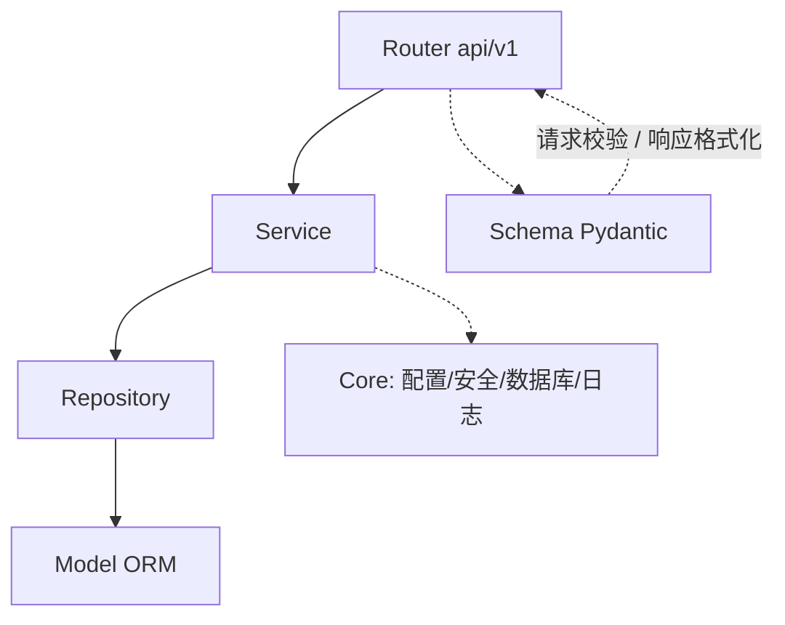

# Backend 架构

## 技术栈

FastAPI + SQLAlchemy 2.0 + Pydantic 2 + PyMySQL + Redis + APScheduler。

## 分层结构



| 层 | 目录 | 职责 | 约束 |
| --- | --- | --- | --- |
| Router | `app/api/v1/` | 路由注册、参数校验、统一响应 | 不含业务逻辑；不直接操作数据库 |
| Service | `app/services/` | 业务逻辑、权限、告警计算、任务调度 | 事务提交/回滚在此层 |
| Repository | `app/repositories/` | 数据访问、分页、查询封装 | 只做数据读写，不做业务判断 |
| Model | `app/models/` | SQLAlchemy ORM 实体 | 与 `sql/ops_monitor_schema.sql` 一致 |
| Schema | `app/schemas/` | Pydantic 模型 | 请求校验与响应格式化分离 |
| Core | `app/core/` | 配置、安全、数据库、调度、种子 | 全局单例 |
| Middleware | `app/middleware/` | 请求上下文、操作审计 | — |
| Exceptions | `app/exceptions/` | 统一异常与错误码 | — |
| Utils | `app/utils/` | 响应、请求工具 | — |

## 目录结构

```text
backend/app/
├── api/v1/       # auth users servers monitor dashboard alerts tasks roles agent health
├── models/       # user server metric alert task
├── schemas/      # auth user agent server monitor alert task
├── services/     # auth user agent server monitor alert_engine alert task
├── repositories/ # base user audit server metric alert task
├── core/         # config database security scheduler seed
├── middleware/   # request_context operation_log
├── exceptions/   # app_exception error_codes handlers
├── utils/        # response request
└── main.py
```

## 应用生命周期

`main.py` 通过 `lifespan` 完成：

1. `SEED_INIT_DATA` 为真时执行幂等种子（角色/权限/默认告警规则/管理员）。
2. 启动 APScheduler 后台调度器；关闭时停止。

## 后台调度

`core/scheduler.py` 注册以下周期任务：

| 任务 | 周期 | 说明 |
| --- | --- | --- |
| 刷新 Agent 状态 | `AGENT_STATUS_REFRESH_SECONDS`（默认 30s） | 按心跳刷新 ONLINE/WARNING/OFFLINE |
| 清理历史指标 | 24h | 删除超过 `METRIC_RETENTION_DAYS` 的指标 |
| 告警评估 | `ALERT_EVALUATE_INTERVAL_SECONDS`（默认 10s） | 驱动告警状态机 |
| 任务超时扫描 | 30s | RUNNING 超时置 TIMEOUT |
| CRON 任务触发 | 30s | 到期 CRON 任务生成执行批次 |

## 中间件

- `RequestContextMiddleware`：生成/透传 `X-Request-ID`，best-effort 解析当前用户。
- `OperationLogMiddleware`：记录受保护接口到 `sys_operation_log`，跳过 `/api/v1/agent/*` 高频路径；独立事务写入，异常不阻断请求。

## 统一响应与错误处理

- 响应：`{code, message, data}`，`code=0` 成功。
- 异常：`AppException` 与全局处理器统一输出；错误码见 [reference/error-codes.md](../reference/error-codes.md)。

## 相关文档

- [reference/api.md](../reference/api.md)
- [reference/database.md](../reference/database.md)
- [reference/configuration.md](../reference/configuration.md)
