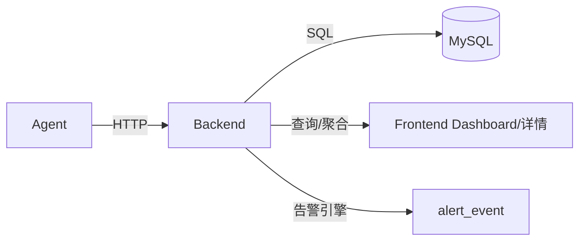
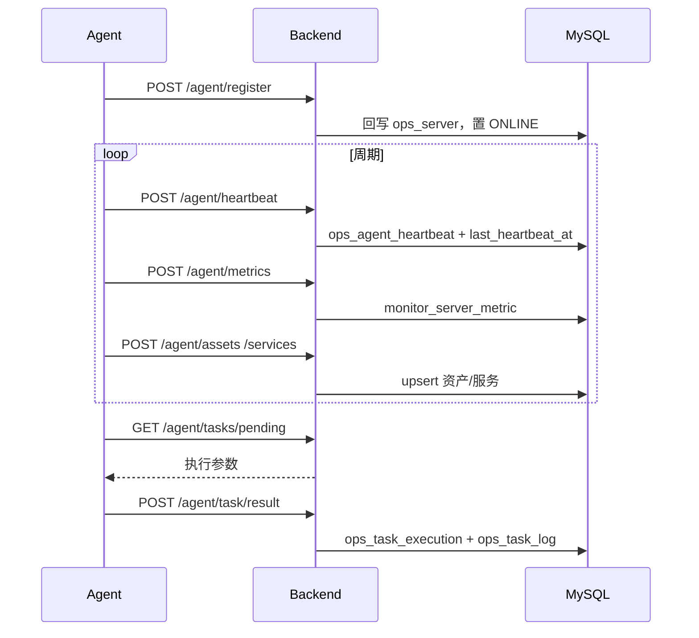
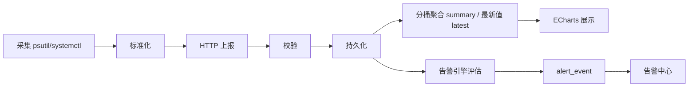
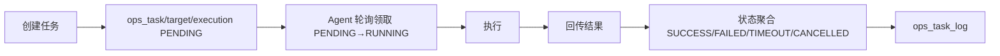
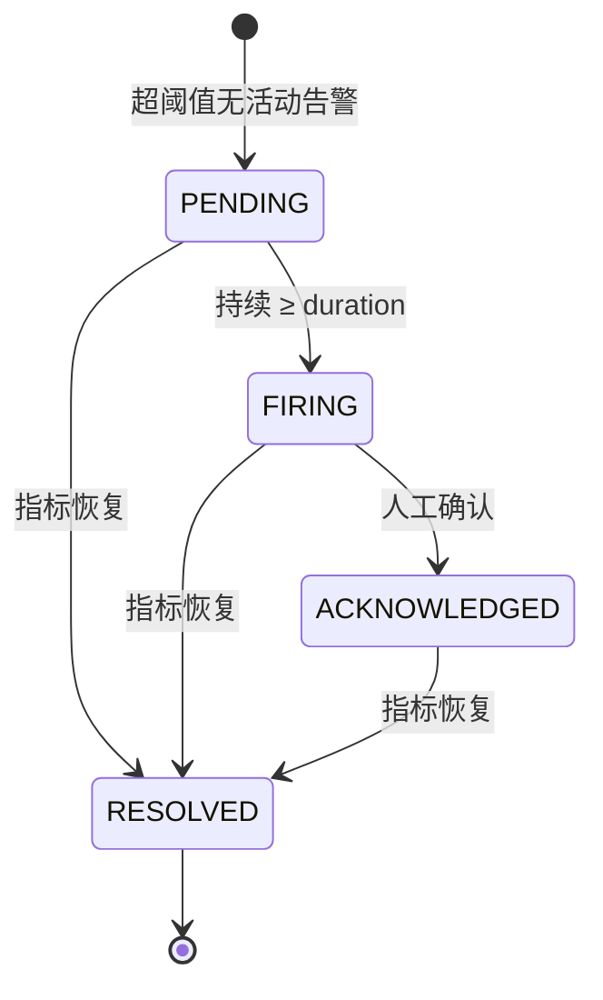

# 数据流

> 本文档描述系统主要数据流。部分内容需结合实现继续补充，未确认处使用 `TODO`。

## 概览

## Agent → Backend

Agent 主动发起以下请求（详见 [reference/agent-protocol.md](../reference/agent-protocol.md)）：

| 数据 | 接口 | 频率 | 落库 |
| --- | --- | --- | --- |
| 注册 | `POST /agent/register` | 启动时 | 回写 `ops_server` 系统信息，置 ONLINE |
| 心跳 | `POST /agent/heartbeat` | 30s | `ops_agent_heartbeat`、更新 `last_heartbeat_at` |
| 指标 | `POST /agent/metrics` | 10s | `monitor_server_metric` |
| 资产 | `POST /agent/assets` | 60s | `ops_server_disk`、`ops_server_network` |
| 服务状态 | `POST /agent/services` | 60s | `ops_server_service` |
| 任务结果 | `POST /agent/task/result` | 执行后 | `ops_task_execution`、`ops_task_log` |

## Backend → Frontend

前端经 Nginx `/api` 调用后端接口获取数据，主要读取：

- `GET /servers`、`GET /servers/{id}`、`GET /servers/{id}/services`
- `GET /servers/{id}/metrics/latest|history|summary`
- `GET /dashboard/overview`
- `GET /alerts`、`GET /tasks`

> **TODO**: 结合前端实际调用补充各页面的数据依赖与刷新周期。

## 监控数据流

- 高频指标独立存储；历史查询使用联合索引 `(server_id, collected_at)`。
- 网络为累计字节数，summary 对相邻桶差分输出速率（MB/s）。
- 指标保留期由 `METRIC_RETENTION_DAYS` 控制，调度器每日清理。

## 任务数据流

## 告警数据流

调度器周期评估（启用规则 × 服务器最新指标/心跳），驱动以下状态机；每次状态变化写 `alert_event_log`。

## TODO

> **TODO**: 补充 Agent 重连后的数据一致性策略（离线期间指标是否补传）。
> **TODO**: 补充告警通知渠道（当前按需求边界不包含）的扩展数据流。
