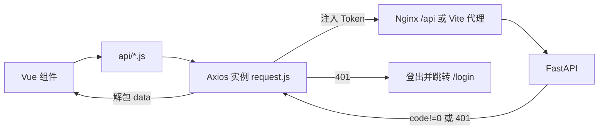

# Frontend 架构

## 技术栈

Vue 3 + Vite + Element Plus + Pinia + Vue Router + Axios + ECharts。

## 目录结构

```text
frontend/src/
├── utils/
│   ├── request.js      # Axios 实例与拦截器（Token 注入、401 跳登录、统一解包）
│   └── format.js       # 字节/时长/时间格式化
├── api/                # auth server monitor user role alert task 接口封装
├── store/user.js       # Pinia：Token 持久化、登录/登出、角色判断
├── router/index.js     # 路由表 + 全局守卫（未登录/角色限制/会话恢复）
├── layout/index.vue    # 侧边菜单 + 顶栏（按角色渲染）
├── config/index.js     # 常量（状态映射、时间范围、角色）
├── components/MetricChart.vue  # ECharts 通用折线组件
└── views/
    ├── login/index.vue
    ├── dashboard/index.vue
    ├── server/index.vue  server/detail.vue
    ├── alert/index.vue
    ├── task/index.vue
    └── system/user.vue
```

## 请求层

- `utils/request.js` 统一 `baseURL=/api/v1`，注入 `Authorization: Bearer`；响应解包 `data`；`401` 触发登出并跳转登录。
- 开发环境由 `vite.config.js` 将 `/api` 代理到 `http://127.0.0.1:8000`；生产由 Nginx 同源反代。



## 状态与鉴权

- `store/user.js`：`token` 持久化于 `localStorage`，`fetchMe()` 拉取用户与角色，提供 `hasRole`/`isAdmin`。
- 路由守卫：未登录跳 `/login`；已登录访问 `/login` 跳 `/dashboard`；`meta.roles` 限制；**启动/刷新时异步恢复用户信息**（仅尝试一次）。

## 页面与权限

| 页面 | 路径 | 权限 |
| --- | --- | --- |
| 登录 | `/login` | 公开 |
| 监控总览 | `/dashboard` | 登录 |
| 服务器管理/详情 | `/servers`、`/servers/:id` | 登录 |
| 告警中心 | `/alerts` | 登录（确认/恢复限 admin/ops） |
| 任务中心 | `/tasks` | admin/ops |
| 用户管理 | `/system/users` | SYSTEM_ADMIN |

菜单按角色渲染（`layout/index.vue`）。

## 图表

`components/MetricChart.vue` 基于 ECharts 渲染历史趋势（avg/max/min、网络速率 MB/s），服务器详情页按时间范围（1h/6h/24h/7d）切换。

## 相关文档

- [modules/monitoring.md](../modules/monitoring.md)
- [operations/deployment.md](../operations/deployment.md)
