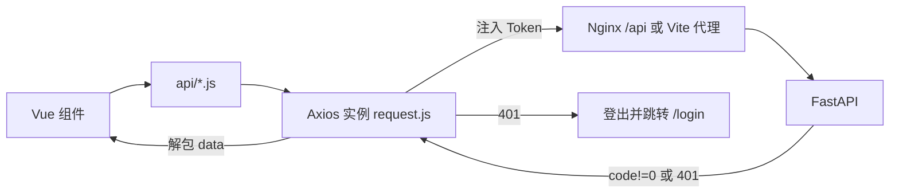

# 前端架构

## 技术栈

Vue 3 + Vite + Element Plus + Tailwind CSS + Pinia + Vue Router + Axios + ECharts。

## 样式体系

- `src/style.css` 为唯一样式入口，引入 Tailwind v4 与 Element Plus，并声明层序
  `theme < base < element-plus < components < utilities`（详见 [ADR-006](../decisions/006-frontend-styling-tailwind.md)）。
- Tailwind 负责布局/间距/响应式/主题；Element Plus 负责表单/表格/弹窗/消息等组件。
- 品牌色由 `@theme` 定义色阶；语义色复用 `var(--el-color-*)`，保证与组件库一致。
- 暗色主题基于 Element Plus dark css-vars + `html.dark`，由 `store/theme.js` 持久化，支持浅色/深色/跟随系统。

## 目录结构

```text
frontend/src/
├── utils/
│   ├── request.js      # Axios 实例与拦截器（Token 注入、空参清理、401 跳登录、解包、网关错误友好化/重试）
│   ├── clipboard.js    # 复制工具（Clipboard API，失败降级 execCommand）
│   └── format.js       # 字节/时长/时间格式化
├── api/                # auth server monitor user role alert task 接口封装
├── store/
│   ├── user.js         # Pinia：Token 持久化、登录/登出、角色判断
│   └── theme.js        # Pinia：主题模式（light/dark/system）与持久化
├── router/index.js     # 路由表 + 全局守卫（未登录/角色限制/会话恢复）
├── layout/index.vue    # 可折叠侧栏 + 小屏抽屉 + 顶栏（按角色渲染）
├── config/index.js     # 常量（状态映射、时间范围、角色）
├── components/MetricChart.vue  # ECharts 通用折线组件（ResizeObserver 自适应）
└── views/
    ├── login/index.vue
    ├── dashboard/index.vue
    ├── server/index.vue  server/detail.vue
    ├── alert/index.vue
    ├── task/index.vue
    └── system/user.vue
```

## 请求层

- `utils/request.js` 统一 `baseURL=/api/v1`，注入 `Authorization: Bearer`；请求前剔除值为 `''`/`null`/`undefined` 的查询参数（避免整型/枚举校验失败）；响应解包 `data`；`401` 触发登出并跳转登录。
- 网关抖动（`502/503/504`）对幂等 `GET` 退避重试 2 次，最终提示“服务暂未就绪，请稍后重试”。
- 开发环境由 `vite.config.js` 将 `/api` 代理到 `http://127.0.0.1:8000`；生产由 Nginx 同源反代。
- 复制操作统一走 `utils/clipboard.js`：优先 Clipboard API，非安全上下文或失败时降级 `execCommand`。


```mermaid
flowchart LR
    V[Vue 组件] --> API[api/*.js]
    API --> AX[Axios 实例 request.js]
    AX -->|注入 Token| GW[Nginx /api 或 Vite 代理]
    GW --> BE[FastAPI]
    BE -->|code!=0 或 401| AX
    AX -->|401| LOGIN[登出并跳转 /login]
    AX -->|解包 data| V
```

## 状态与鉴权

- `store/user.js`：`token` 持久化于 `localStorage`，`fetchMe()` 拉取用户与角色，提供 `hasRole`/`isAdmin`。
- `store/theme.js`：主题模式持久化于 `localStorage`，启动时应用到 `<html>`，`system` 模式响应系统主题变化。
- 路由守卫：未登录跳 `/login`；已登录访问 `/login` 跳 `/dashboard`；`meta.roles` 限制；**启动/刷新时异步恢复用户信息**（仅尝试一次）。

## 页面与权限

| 页面 | 路径 | 权限 |
| --- | --- | --- |
| 登录 | `/login` | 公开 |
| 监控总览 | `/dashboard` | 登录 |
| 服务器管理/详情 | `/servers`、`/servers/:id` | 登录 |
| 告警中心 | `/alerts` | 登录（确认/恢复限 admin/ops） |
| 任务中心 | `/tasks` | admin/ops |
| 用户管理 | `/system/users` | SYSTEM_ADMIN |

菜单按角色渲染（`layout/index.vue`）。布局桌面端支持折叠，小屏（<1024px）切换为抽屉；栅格按 `xs/sm/md` 响应式。

## 图表

`components/MetricChart.vue` 基于 ECharts 渲染历史趋势（avg/max/min、网络速率 MB/s），通过 `ResizeObserver` 随容器尺寸自适应（侧栏折叠/栅格重排）。服务器详情页按时间范围（1h/6h/24h/7d）切换。

## 相关文档

- [modules/monitoring.md](../modules/monitoring.md)
- [operations/deployment.md](../operations/deployment.md)
