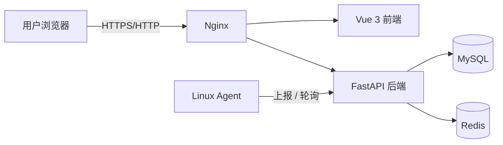
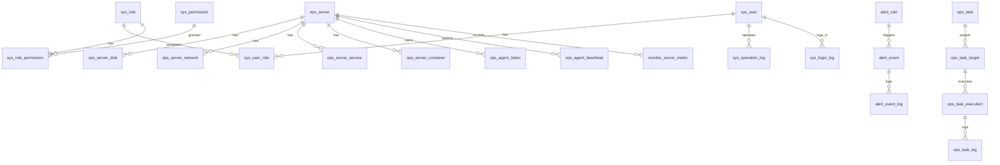

# 架构概览

> 本文档自包含描述系统当前架构，不依赖仓库外部资料。

## 系统上下文

`ops-monitor` 是面向 Linux 服务器的轻量级运维监控与自动化管理平台。用户通过浏览器访问 Web 管理端，平台通过 Python Agent 采集被监控服务器状态，并提供监控、告警与服务管理能力。

## 核心组件

### Frontend

Vue 3 + Vite + Element Plus 单页应用，提供登录、Dashboard、服务器管理、监控图表（ECharts）、告警中心、任务中心与用户管理。经 Nginx 同源访问 `/api`。

详见 [frontend.md](frontend.md)。

### Backend

FastAPI 应用，采用 `Router → Service → Repository → Model` 分层，统一响应 `{code, message, data}`，提供认证鉴权、服务器资产、监控查询、告警引擎、任务引擎与审计能力。

详见 [backend.md](backend.md)。

### Agent

部署在被监控 Linux 服务器上的 Python 程序，负责系统指标采集、服务状态采集、心跳上报与受控任务执行。以 systemd 原生部署（不做核心容器化）。

详见 [agent.md](agent.md) 与 [reference/agent-protocol.md](../reference/agent-protocol.md)。

### Database

MySQL 8.0 存储，业务数据与监控数据逻辑分离。核心域：用户权限、服务器资产与 Agent、监控指标、告警、自动化任务、登录与审计。共 26 张表。

详见 [reference/database.md](../reference/database.md)。

### Deployment

Docker Compose 编排 `nginx`、`backend`、`mysql`、`redis`；平台采用配置化部署（`deploy/config.yml` + `install.sh`）。Agent 单独以 systemd 部署。

详见 [operations/deployment.md](../operations/deployment.md)。

## 主要数据关系

## 认证边界

- 用户侧：JWT（Bearer），由后端签发与校验，前端经 Axios 注入。
- Agent 侧：独立 Token（数据库仅存 SHA-256 哈希），通过 `Authorization: Bearer <token>` 访问 `/api/v1/agent/*`。

详见 [security.md](security.md) 与 [modules/authentication.md](../modules/authentication.md)。

## 监控边界

- 平台监控被管理服务器与服务的业务指标（[modules/monitoring.md](../modules/monitoring.md)）。
- 平台自身可观测性（健康检查、日志等）见 [operations/monitoring.md](../operations/monitoring.md)。

## 任务执行边界

平台创建任务 → Agent 轮询领取 → 受控执行 → 回传结果 → 状态聚合。任务仅允许白名单服务与受限操作，禁止任意 Shell。

详见 [modules/automation.md](../modules/automation.md) 与 [decisions/005-task-polling-dispatch.md](../decisions/005-task-polling-dispatch.md)。

## TODO

> **TODO**: 补充生产环境网络拓扑（HTTPS、反向代理与多主机部署）的说明。
