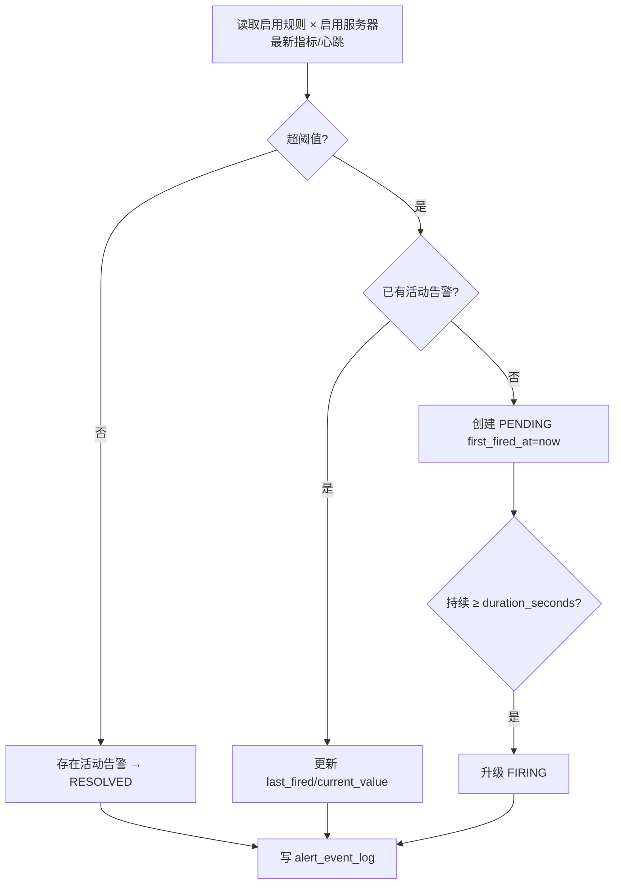
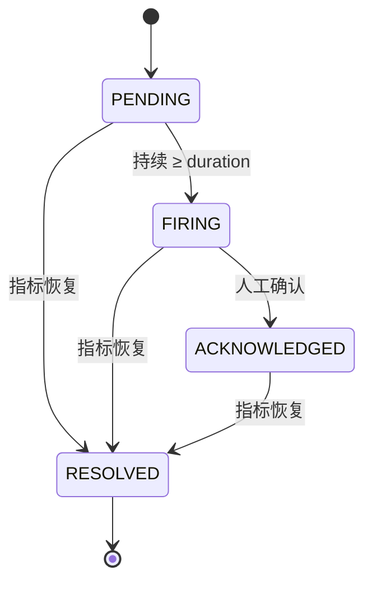

# 告警中心

> 本文描述阈值告警的规则、事件与状态机。

## 告警引擎

**定时扫描 + DB 状态机持久化**：APScheduler 每 `ALERT_EVALUATE_INTERVAL_SECONDS`（默认 10s）执行一轮评估。

### 状态机

- **去重**：`alert_key = {rule_id}:{server_id}:{metric_type}` + 生成列 `is_active` 唯一键，保证同一告警仅一条活动记录；恢复后 `is_active=NULL`，可再次触发。
- **ACKNOWLEDGED 保持活动**：确认后引擎仍跟踪，指标恢复时才解除。

## 规则语义

| metric_type | 取值 | 阈值语义 |
| --- | --- | --- |
| CPU / MEMORY / DISK | 最新指标值 | `value OP threshold` |
| LOAD | `load_1m` | threshold 视为 **cpu_cores 倍数** |
| AGENT | `last_heartbeat_at` | value = 距当前秒数，`> threshold` |

- operator：GT/GTE/LT/LTE/EQ（默认 GT）。
- `duration_seconds`：PENDING→FIRING 所需持续时长。
- `recovery_threshold`：低于即恢复；为空则回到阈值以下恢复。
- 作用域：全局规则，作用于所有启用服务器。

## 默认规则（启动幂等种子）

| 指标 | 级别 | 阈值 | 持续 |
| --- | --- | --- | --- |
| CPU | WARNING/CRITICAL | 80 / 95 | 300s / 120s |
| MEMORY | WARNING/CRITICAL | 80 / 95 | 300s / 120s |
| DISK | WARNING/CRITICAL | 85 / 95 | 300s / 120s |
| LOAD | WARNING/CRITICAL | 1.0 / 2.0（核数倍数） | 300s / 120s |
| AGENT | WARNING/CRITICAL | 90 / 180 | 0 |

## 告警 API

| Method | Endpoint | 说明 | 权限 |
| --- | --- | --- | --- |
| GET | `/api/v1/alerts` | 事件分页（status/severity/server_id/active） | 登录 |
| GET | `/api/v1/alerts/{id}` | 事件详情（含状态日志） | 登录 |
| POST | `/api/v1/alerts/{id}/ack` | 确认 | admin/ops |
| POST | `/api/v1/alerts/{id}/resolve` | 恢复 | admin/ops |
| GET | `/api/v1/alerts/rules` | 规则列表 | 登录 |
| POST | `/api/v1/alerts/rules` | 创建规则 | admin |
| PUT | `/api/v1/alerts/rules/{id}` | 更新规则 | admin |
| DELETE | `/api/v1/alerts/rules/{id}` | 删除规则 | admin |

> 路由顺序：`/alerts/rules` 声明在 `/alerts/{event_id}` 之前，避免被路径参数捕获。

## 前端

- `views/alert/index.vue`：事件列表（筛选/确认/恢复/详情时间线）+ 规则管理 tab。
- Dashboard「实时告警」卡片：`active_alerts` 计数。

## 说明

- 通知渠道（短信/微信/钉钉）按需求边界不包含，仅事件管理。
- SERVICE/CONTAINER 规则随服务管理接入，当前不评估。
