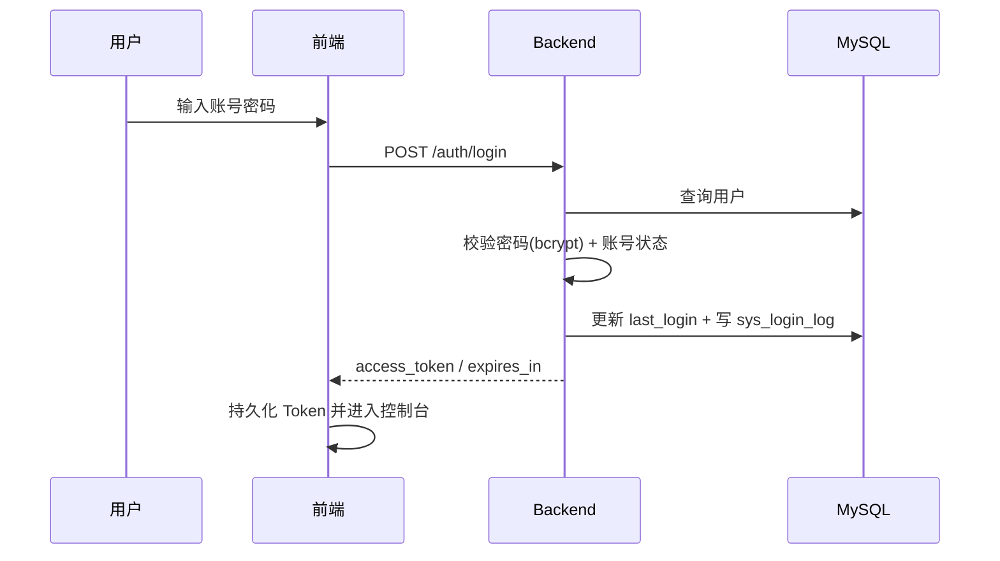

# 认证

> 本文描述用户登录与身份认证机制。

## 用户认证

- 方式：账号密码登录，签发 JWT（HS256），前端以 `Authorization: Bearer <token>` 携带。
- 有效期：`JWT_EXPIRE_MINUTES`（默认 120 分钟，即 `expires_in=7200`）。
- payload：`sub`（用户 ID）、`iat`、`exp`。

### 登录流程

失败（用户名/密码错误、账号禁用）同样记录登录日志。

### 登录接口

| Method | Endpoint | 说明 | 权限 |
| --- | --- | --- | --- |
| POST | `/api/v1/auth/login` | 登录，返回 `{access_token, token_type, expires_in}` | 公开 |
| GET | `/api/v1/auth/me` | 当前用户信息（含角色） | 登录 |

## Agent 认证

- 使用独立 Token，不走用户 JWT。
- Token 由平台生成，数据库仅存 SHA-256 哈希；明文仅返回一次。
- Agent 经 `Authorization: Bearer <token>` 访问 `/api/v1/agent/*`。

## 会话恢复（前端）

前端启动/刷新时若已持有 Token 但无用户信息，会异步调用 `/auth/me` 恢复角色（仅尝试一次）；失败由拦截器登出。

## 错误码

| 错误码 | HTTP | 含义 |
| --- | --- | --- |
| 40100 | 401 | 未认证或 Token 无效 |
| 40101 | 401 | 用户名或密码错误 |
| 40102 | 401 | 账号已禁用 |
| 40103 | 401 | Agent 凭证无效 |

完整错误码见 [reference/error-codes.md](../reference/error-codes.md)。

## 相关决策

- [decisions/003-authentication.md](../decisions/003-authentication.md)
