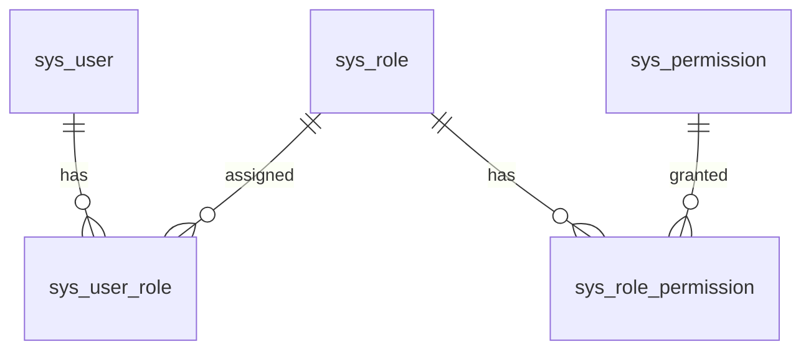

# 权限（RBAC）

> 本文描述基于角色的访问控制模型与接口权限。

## 模型

- 用户与角色、角色与权限均为多对多。
- 权限类型：`MENU` / `API` / `BUTTON`。
- 权限自关联（`parent_id`）支持菜单树。

## 默认角色

| 角色编码 | 名称 | 权限概述 |
| --- | --- | --- |
| `SYSTEM_ADMIN` | 系统管理员 | 用户/角色/服务器/监控/告警/任务/日志全部管理 |
| `OPS_ENGINEER` | 运维人员 | 服务器监控、服务管理、运维任务、告警处理 |
| `NORMAL_USER` | 普通用户 | 查看授权服务器及监控数据 |

## 接口鉴权

- 依赖：`get_current_user`（解析 Token → 用户，禁用抛 401）、`require_roles(*role_codes)`（角色交集校验，失败抛 403）。
- 典型限制：
  - 用户管理 `/users`：`SYSTEM_ADMIN`
  - 服务器管理写操作：`SYSTEM_ADMIN`
  - 告警确认/恢复、任务操作：`SYSTEM_ADMIN`/`OPS_ENGINEER`
  - 监控查询：登录用户

## 用户与角色管理 API

| Method | Endpoint | 说明 | 权限 |
| --- | --- | --- | --- |
| GET | `/api/v1/users` | 用户分页列表（username/status 筛选） | SYSTEM_ADMIN |
| POST | `/api/v1/users` | 创建用户（可分配角色） | SYSTEM_ADMIN |
| GET | `/api/v1/users/{id}` | 用户详情 | SYSTEM_ADMIN |
| PUT | `/api/v1/users/{id}` | 更新用户/角色 | SYSTEM_ADMIN |
| DELETE | `/api/v1/users/{id}` | 软删除用户 | SYSTEM_ADMIN |
| GET | `/api/v1/roles` | 角色列表（用户管理下拉） | SYSTEM_ADMIN |

## 前端权限

- `store/user.js` 提供 `hasRole`/`isAdmin`。
- 路由 `meta.roles` 限制页面；菜单按角色渲染。

## 错误码

| 错误码 | HTTP | 含义 |
| --- | --- | --- |
| 40300 | 403 | 无权限 |
| 40301 | 403 | 服务不允许受控操作 |

## TODO

> **TODO**: 补充权限码（`sys_permission`）与接口的完整映射清单。
