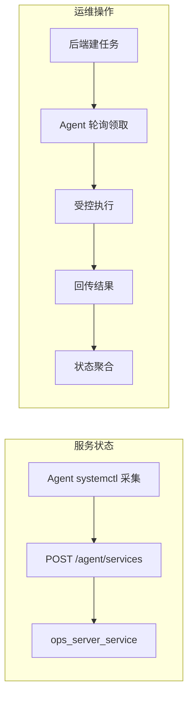
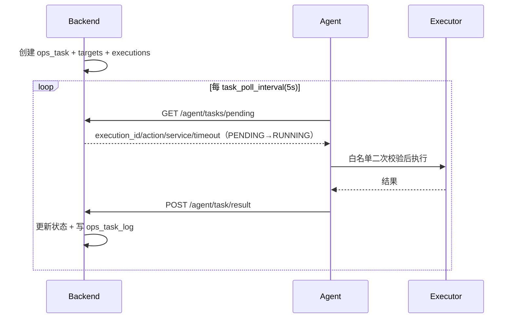
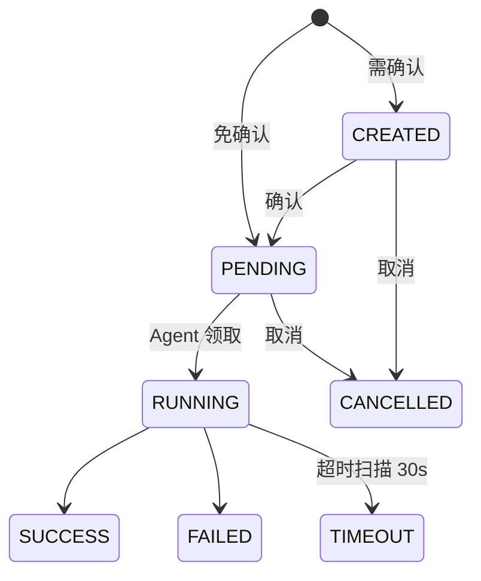

# 自动化任务

> 本文描述任务引擎：任务创建、分发、执行与状态聚合。

## 总体机制

### 任务分发（Agent 轮询）

## 任务模型与状态机

- `task.status` 由 executions 聚合：任一活跃→RUNNING；任一 FAILED/TIMEOUT→FAILED；全 SUCCESS→SUCCESS。
- 批量任务：每台服务器独立 execution，前端展示独立结果。

### 任务类型

| task_type | action | 说明 |
| --- | --- | --- |
| SERVICE_CHECK | STATUS | 服务状态检查（只读） |
| SERVICE_ACTION | START/STOP/RESTART | 受控操作，默认需二次确认 |
| SERVICE_LOG | LOGS | 日志抓取 |

## 定时任务（CRON）

- `schedule_type=CRON` + `cron_expression`（5 字段）。
- 创建即 CREATED，确认后 PENDING；调度器每 30s 用 croniter 计算到期，触发时生成执行批次。
- **当前为单次触发**：执行完成后任务结束；周期性多轮执行需后续任务行级 schema 迭代（`ops_task_target/execution` 存在 `(task_id, target_id)` 唯一约束）。

## 任务 API

| Method | Endpoint | 说明 | 权限 |
| --- | --- | --- | --- |
| GET | `/api/v1/tasks` | 任务分页列表 | admin/ops |
| POST | `/api/v1/tasks` | 创建任务（单机/批量/定时） | admin/ops |
| GET | `/api/v1/tasks/{id}` | 详情（各服务器执行结果+日志） | admin/ops |
| POST | `/api/v1/tasks/{id}/confirm` | 二次确认 | admin/ops |
| POST | `/api/v1/tasks/{id}/cancel` | 取消 | admin/ops |
| GET | `/api/v1/agent/tasks/pending` | Agent 轮询领取 | Agent Token |
| POST | `/api/v1/agent/task/result` | Agent 回传结果 | Agent Token |

## 前端

`views/task/index.vue`：任务中心（列表/新建/确认/取消/详情含各服务器执行日志）。

## 相关决策

- [decisions/005-task-polling-dispatch.md](../decisions/005-task-polling-dispatch.md)
