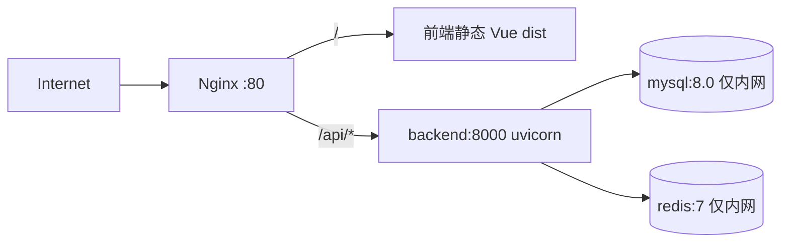

# 部署

> 本文描述 `ops-monitor` 平台的部署方式（Docker Compose 配置化部署）。

## 组件与拓扑



- **单 Nginx 入口**：镜像多阶段（node 构建前端 → nginx:alpine 托管），承担静态与 `/api` 反代。
- backend 独立镜像：`python:3.11-slim`、非 root、HEALTHCHECK。
- mysql/redis 不暴露宿主端口，数据落在 `DATA_VOLUME_DIR`。
- `deploy/mysql/init/` 首启挂载自动建表；lifespan 幂等 seed 默认角色/规则/管理员。

### 部署文件位置

| 文件 | 位置 |
| --- | --- |
| Compose 编排 | `deploy/docker/compose.yml` |
| backend 镜像 | `deploy/docker/Dockerfile.backend` |
| nginx + 前端镜像 | `deploy/nginx/Dockerfile` |
| Nginx 配置 | `deploy/nginx/conf.d/default.conf` |
| 建表脚本 | `deploy/mysql/init/ops_monitor_schema.sql` |

## 前置条件

- Docker 与 Docker Compose v2
- bash 与基础命令（`sed`、`od`、`tr`、`curl`）；**无需宿主机 Python**
- 可用端口（默认 80）

## 快速开始（配置化部署）

```bash
cp deploy/config.env.tmpl deploy/config.env   # 编辑 HOSTNAME/HTTP_PORT/密码
./deploy/install.sh                            # 校验 → 渲染 → 构建/拉取 → 启动 → 健康检查
./deploy/check.sh                              # 部署体检（只读）
# 修改 config.env 后重新渲染并重建：
./deploy/reconfigure.sh
```

访问 `http://<HOSTNAME>:<HTTP_PORT>`；初始管理员见 `config.env`（留空由脚本生成并回写）。

## 脚本职责

| 脚本 | 作用 |
| --- | --- |
| `prepare.sh` | 校验 `config.env`（`--check` 只读）；渲染 `deploy/.env`；空密钥生成并回写（保留注释）；HTTPS 覆盖与证书就位；创建数据目录 |
| `migrate-config.sh` | 一次性迁移：`config.yml` → `config.env`（保留原密钥） |
| `install.sh` | 前置检查 → 生成/迁移配置 → prepare → `pull` 或 `build` → 等健康 → 打印访问信息 |
| `reconfigure.sh` | `check.sh` → `prepare.sh` → `docker compose up -d`（数据保留） |
| `check.sh` | 只读体检：docker/compose、配置校验、端口占用、数据目录可写 |

## 手动方式（等价）

```bash
docker compose -f deploy/docker/compose.yml --env-file deploy/.env up -d --build
docker compose -f deploy/docker/compose.yml --env-file deploy/.env ps
docker compose -f deploy/docker/compose.yml --env-file deploy/.env logs -f backend
docker compose -f deploy/docker/compose.yml --env-file deploy/.env down       # 保留数据
docker compose -f deploy/docker/compose.yml --env-file deploy/.env down -v    # 连同数据清理
```

## Nginx 配置

- `location /api/` → `proxy_pass http://backend:8000`（Host/X-Forwarded-For/X-Request-ID 透传）。
- `location /` → SPA history 路由回退 `index.html`；静态缓存、gzip。
- HTTPS：`config.env` 的 `HTTPS_ENABLED=true` 时自动生成 443 配置与端口映射。

## 环境变量

部署配置项见 [reference/configuration.md](../reference/configuration.md)。

## 部署验证

1. `docker compose -f deploy/docker/compose.yml --env-file deploy/.env ps` 全部 healthy。
2. `curl http://<host>:<port>/api/v1/health` 返回 `{db:true, redis:true}`。
3. 浏览器登录并进入 Dashboard。
4. 生成服务器凭证 → 部署 Agent → 服务器变 ONLINE（见 [agent-deployment.md](agent-deployment.md)）。

## 上线安全清单

- 修改 `JWT_SECRET_KEY` 与 DB/Redis 密码（`deploy/config.env`，不入库）。
- 修改/移除种子管理员默认密码。
- 正式环境启用 HTTPS（证书就位 + `HTTPS_ENABLED=true`）。
- 操作审计、命令白名单、Agent Token 哈希已内置。

## 相关决策

- [decisions/004-configuration-driven-deployment.md](../decisions/004-configuration-driven-deployment.md)
