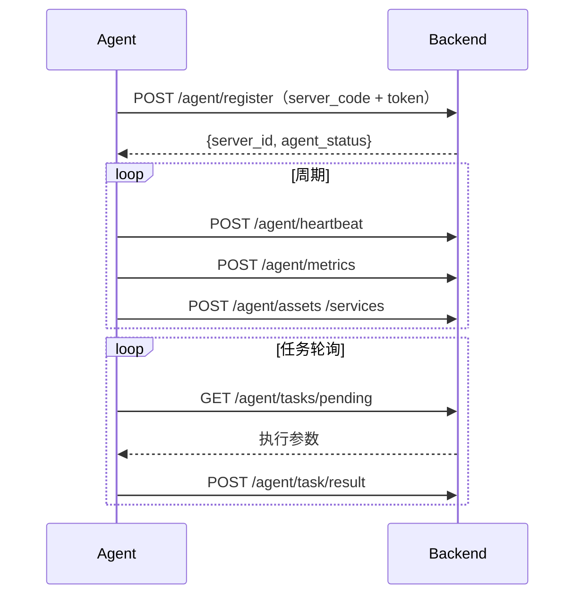

# Agent Protocol

> 本文描述 Agent 与 Backend 之间的通信协议。实现见 `agent/`（Python）与 `agent-go/`（Go），两者功能对等、可互换。后端接口见 `backend/app/api/v1/agent.py`。

## Overview

通信方向恒为 **Agent → Backend**（主动上报/轮询），后端不主动连接 Agent。所有 Agent 接口位于 `/api/v1/agent/*`，使用独立 Token 鉴权。

协议与具体实现无关：Python 与 Go 两个 Agent 使用同一份接口契约与 `config.yaml` schema，后端无需区分。安装包按 `runtime` 参数区分（`/api/v1/agent/package?runtime=python|go`，默认 `python`）。

## Authentication

- 请求头：`Authorization: Bearer <Agent Token>`。
- Token 由平台生成，数据库仅存 SHA-256 哈希；`register` 时 Token 在请求体与请求头中同时携带。
- 校验失败返回 `401`（错误码 `40103`）。

## Request Signing

启用后（`AGENT_REQUIRE_SIGNATURE=true` 强制）Agent 请求携带 Ed25519 签名：

- 请求头：`X-Agent-Id`（server_code）、`X-Timestamp`（Unix 秒）、`X-Request-Id`（uuid4）、`X-Signature`（base64 Ed25519）。
- 待签串：`METHOD\nPATH\nTIMESTAMP\nREQUEST_ID\nSHA256_HEX(body)`。
- 公钥：首次注册时在请求体 `signing_public_key`（base64）上报，平台按 Token 绑定存储（仅当尚无公钥时写入）。
- 服务端校验顺序：Token → Agent-Id 归属 → 时间戳偏差（默认 300s）→ 签名 → `X-Request-Id` 防重放（Redis）。
- 失败错误码：`40104` 签名无效、`40105` 重放、`40106` 缺失、`40107` 时间戳非法。
- **公钥轮换**：`POST /api/v1/agent/signing-key`（Bearer 认证；启用签名时同时校验当前签名），提交新的 `signing_public_key` 即时生效；注册时若提供不同的合法公钥亦视为轮换。
- 详见 [decisions/010-agent-request-signing.md](../decisions/010-agent-request-signing.md)。

## Interaction Overview



## Registration

`POST /api/v1/agent/register`

```json
{
  "server_code": "web-01",
  "token": "<TOKEN>",
  "hostname": "web-01",
  "os_name": "Ubuntu",
  "os_version": "22.04",
  "kernel_version": "5.15.0",
  "architecture": "x86_64",
  "cpu_model": "Intel Xeon",
  "cpu_cores": 4,
  "memory_total_bytes": 8589934592,
  "disk_total_bytes": 107374182400,
  "agent_version": "1.0.0"
}
```

服务端校验 Token 与 `server_code` 匹配后回写系统信息并置 `ONLINE`，返回 `{server_id, agent_status}`。

## Heartbeat

`POST /api/v1/agent/heartbeat`

```json
{ "server_id": 10001, "agent_version": "1.0.0", "timestamp": "2026-09-23T00:00:00+00:00" }
```

服务端更新 `last_heartbeat_at` 并记录 `ops_agent_heartbeat`。

## Metrics

`POST /api/v1/agent/metrics`

```json
{
  "server_id": 10001,
  "timestamp": "2026-09-23T00:00:00+00:00",
  "cpu_usage": 72.3,
  "memory_usage": 61.2,
  "memory_used_bytes": 123456789,
  "disk_usage": 81.4,
  "network_in_bytes": 1000000,
  "network_out_bytes": 2000000,
  "load_1m": 2.31, "load_5m": 1.8, "load_15m": 1.2,
  "tcp_connections": 126,
  "uptime_seconds": 360000
}
```

时间合法性校验：与服务器时间偏差超过 300s 拒绝（错误码 `40001`）。

## Assets

`POST /api/v1/agent/assets`：同步磁盘与网卡资产（幂等 upsert，缺失项删除）。

## Services

`POST /api/v1/agent/services`：上报服务状态 `[{service_name, current_status}]`。

## Task Polling

`GET /api/v1/agent/tasks/pending`：领取本服务器待执行任务，服务端将执行置 RUNNING，返回：

```json
[{ "execution_id": 1, "task_id": 10, "action": "STATUS", "service_name": "nginx", "timeout_seconds": 60 }]
```

## Task Result

`POST /api/v1/agent/task/result`

```json
{ "execution_id": 1, "status": "SUCCESS", "exit_code": 0, "result_text": "active", "error_message": null, "error_type": null, "logs": "..." }
```

- `error_type` 可选，用于服务端重试决策（如 `NETWORK_ERROR`、`AGENT_TIMEOUT`）；缺省时服务端按 `error_message` 兜底分类。
- 服务端更新执行状态、写 `ops_task_log`，并聚合任务状态；可重试失败进入 `RETRYING`。
- 幂等：对已结束的 `execution_id` 重复回传返回既有结果（HTTP 200），不重复执行。

## Package and Installer

- `GET /api/v1/agent/package?runtime=python|go`：下载 Agent 安装包（tar.gz，公开）。
  - `python`（默认）：源码 + `install.sh` + systemd 模板。
  - `go`：预编译二进制（`dist/ops-agent-linux-{amd64,arm64}`）+ 配置样例 + `install.sh` + systemd 模板。
- `GET /api/v1/agent/install.sh?runtime=python|go`：获取一键安装脚本（公开）。
- 非法 `runtime` 回退为 `python`。

## Retry Policy

网络失败采用指数退避重试（1s/2s/4s…，封顶 `retry_max_seconds`）。详见 `agent/reporter/client.py`。

## Timeout Policy

- HTTP 请求超时：`request_timeout`（默认 10s）。
- 任务执行超时：由任务 `timeout_seconds` 决定；Agent executor 亦设置超时。

## Idempotency

- 资产/服务同步为幂等 upsert。
- 任务结果重复回传被拒绝（执行已结束返回 `400`）。

## Error Handling

统一响应 `{code, message, data}`；错误码见 [error-codes.md](error-codes.md)。

## Compatibility

- **协议版本**：当前为 `1.0`（无显式版本字段，按字段级兼容管理）。
- **原则**：新增字段一律**可选**（缺少时服务端使用默认）；删除字段或改变语义视为**破坏性变更**，需平台与 Agent 同步升级并在 `CHANGELOG.md` 标注。
- `agent_version` 为 Agent 构建版本，与协议版本独立。

兼容矩阵：

| 能力 | 引入版本 | 兼容性 |
| --- | --- | --- |
| 双运行时（Python / Go） | 0.2.0 | 并行，共享配置 schema |
| 任务 `error_type` | 0.3.0 | 可选；缺失时服务端按 `error_message` 兜底 |
| 请求签名（Ed25519） | 0.3.0 | 可选；`AGENT_REQUIRE_SIGNATURE` 灰度，关闭时无签名放行 |
| 每次尝试独立执行 / 幂等重放 | 0.3.0 | 服务端内部，协议不变 |
